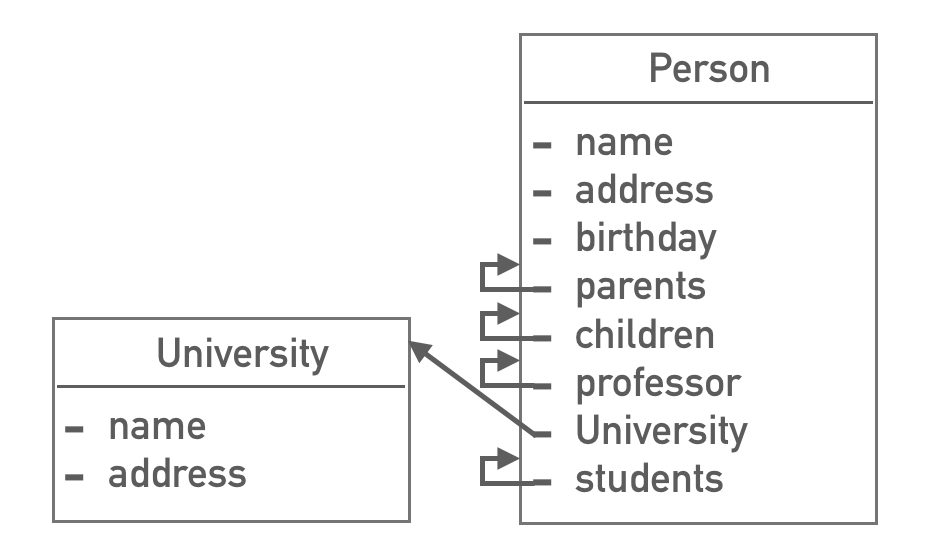
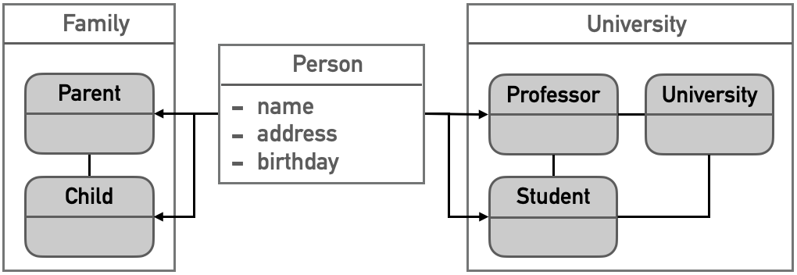
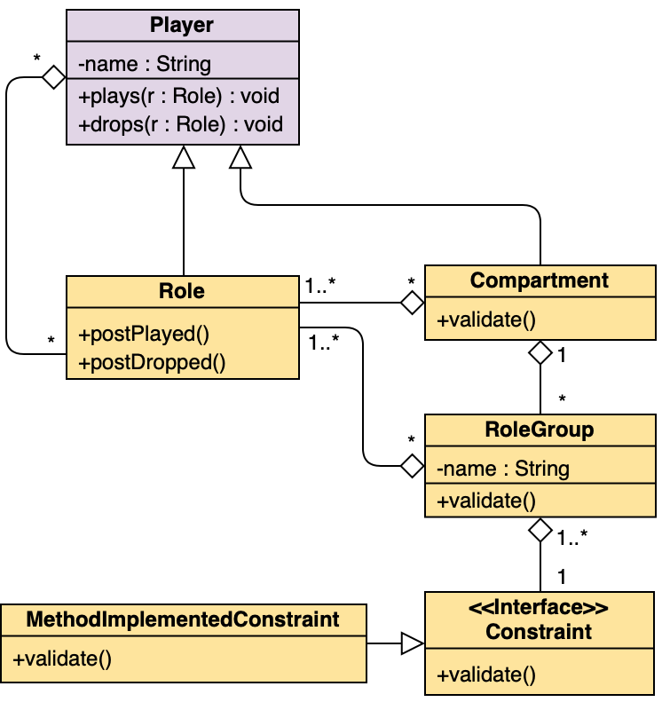
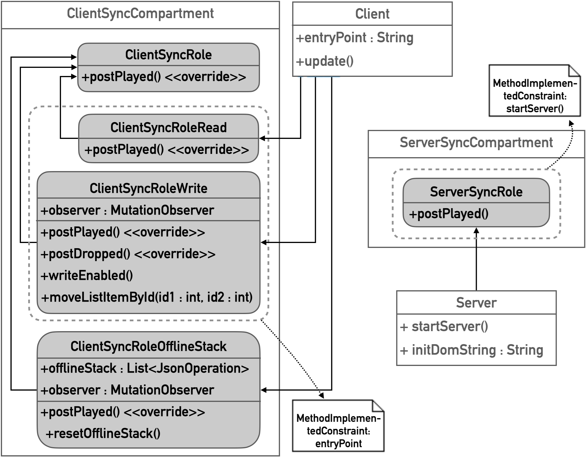
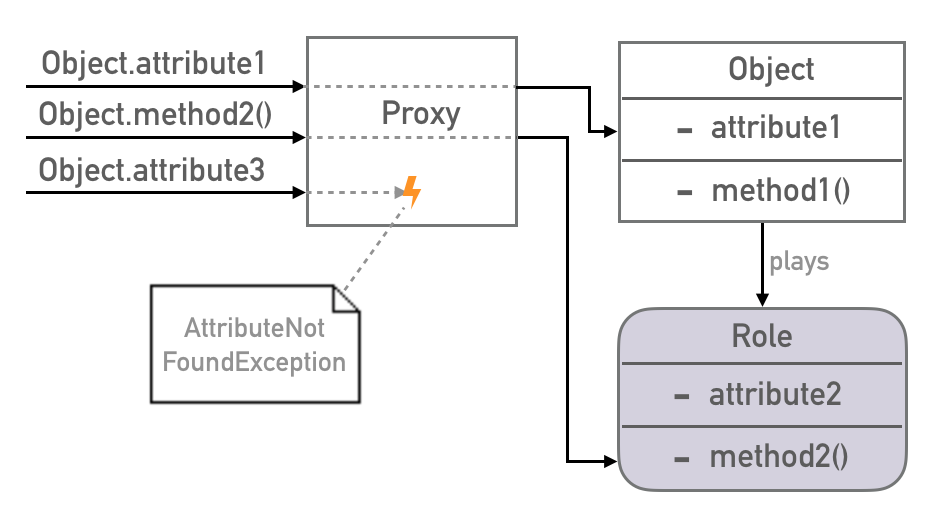
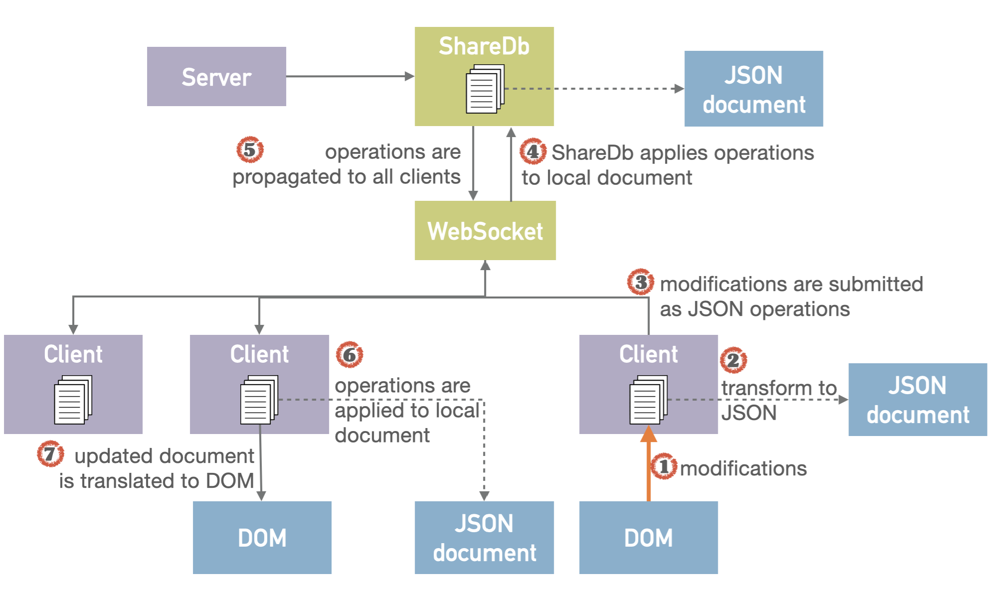

# JavaScRoll

A JavaScript framework for role based modeling in web applications

## Why do we need roles in web applications?

Role based modelling is an extension of object oriented modelling and has some advantages over it: role based modelling allows to specify attributes and behaviour context-specificly and thus adapt dynamically to changing context. Objects only have a basic set of attributes and operations and get enriched by roles with regard to the current context. See the example below: the object oriented approach (left) models the object person with every attribute it needs in every possible scenario. Whereas in the role oriented model (right) the object person only has basic attributes and a set of roles it may play. As soon as an object plays a role, you can call every method and attribute provided by this role direct on the player. So when the person plays all roles at the same time, it has the same extend of functionality as in the object oriented approach. However in all other cases it is more a lot lightweight.

 

## What does this project contain?

- a framework for using role based modelling in web applications
- some synchronisation roles for real-time synchronisation of shared DOMs

## How may I use this?

### 1. Role framework

You may use this framework via instantiation and inheritance of the classes provided by the framework (see the uml diagramm below). In the example web application you can look up the usage in [client|server]SyncRole*.js and [client|server]SyncCompartment and in the tests in roleFramework/tests package.

### 2. Framework for replicated DOM synchronisation

The usage of all synchronisation roles is shown in the example web application in client.js and server.js. Simply create players for client and server via new Player(); and let them play the roles with behaviour you want to achieve. All roles provided by the framework are shown in the diagramm below. Note that when a player wants to play a role playing ClientSyncRole, it has to provide an attribute with name entryPoint, that is the id of the DOM node where the synchronisation should start. Also a player that plays the ServerSyncRole has to provide a method with name startServer() that returns a running server.

## How does it work?

### 1. Role framework

Every player is encapsulated in an object proxy. Every call on a player is redirected to the player itself or any role that provides the requested method or attribute. Benchmarking has shown, that this redirection takes maximum 10% longer than a direct call. 

### 2. Framework for replicated DOM synchronisation

Basically, the framework relies on [ShareDb](https://github.com/share/sharedb) and the data type [ot-json0](https://github.com/ottypes/json0) for real time collaborative interaction with shared content. Thus it relies on Operational Transformation. The overall workflow of DOM synchronsation is shown below. A server provides a ShareDb instance and listens on a web socket for modifications on the stored content. Every client that enters the application, creates a connection to this server and forwards every modification the user makes on the shared content via this web socket. As soon as the server receives a modification of one client, it applies this operation on its stored content and propagates the modification to every other client which also applies the operation to its local copy. The stored document is a json representation of the shared DOM. Every modification the user makes on the DOM is registered via a mutation observer and translated to a json operation which gets then propagated. Every two modifications that happen in parallel and conflict each other get transformed so that both operations achieve its desired goal. 

